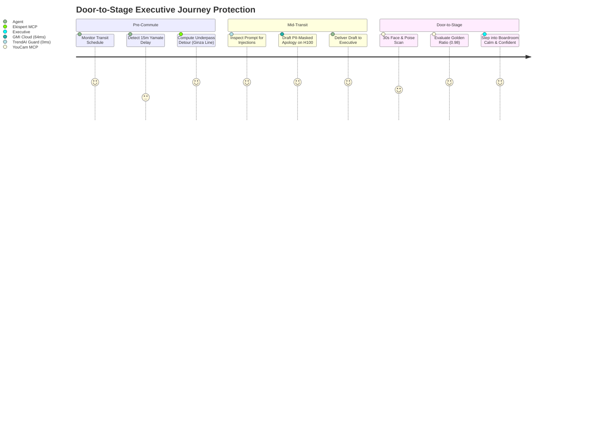
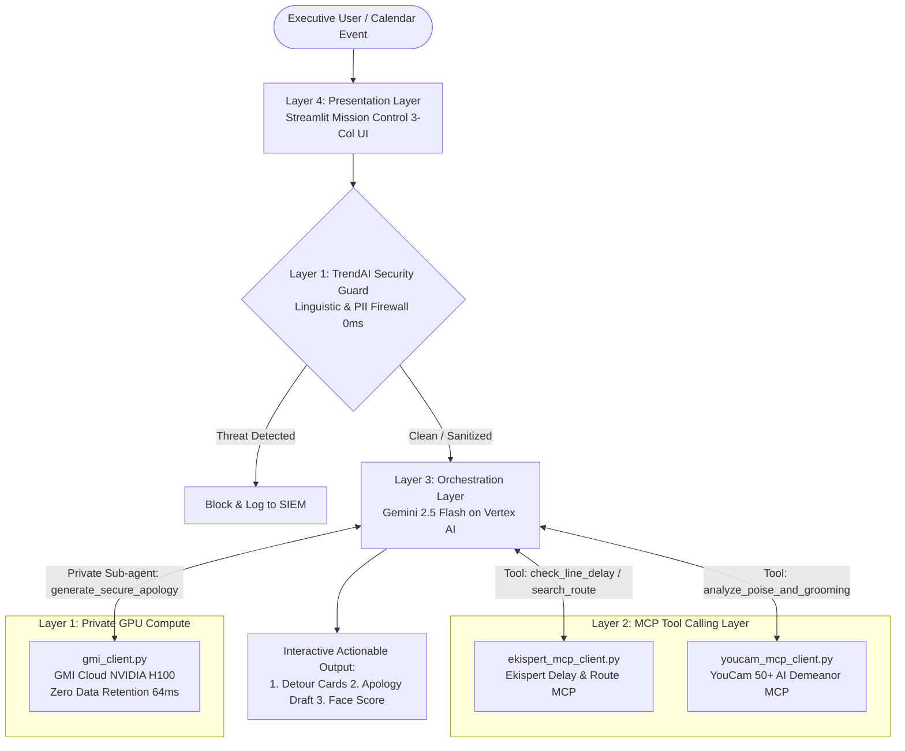
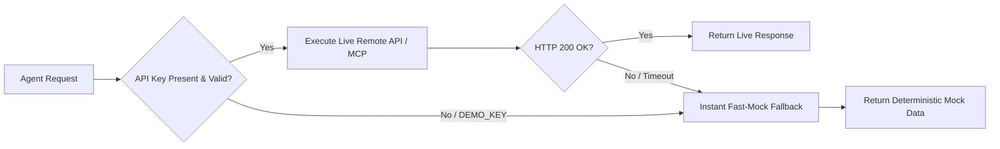

# 🚇 Proactive Commute Shield Enterprise - Technical Specification & Agent Architecture

> [!NOTE]
> **Bilingual Documentation Notice**:  
> This file serves as the authoritative English technical specification, architecture reference, and LLM Agent runtime guide for **Proactive Commute Shield Enterprise**.  
> For the primary user-facing Japanese documentation, please refer to [README.md](README.md).

---

<div align="center">

[](LICENSE)
[](https://www.python.org/)
[](https://streamlit.io/)
[](#6-deterministic-resilience--fast-mock-architecture)
<br>
[-3EA8FF.svg)](https://zenn.dev)
[](https://cloud.google.com/)
[-FFA116.svg)](https://zenn.dev/hackathons/google-cloud-japan-ai-hackathon-vol5)
[](https://zenn.dev/hackathons/google-cloud-japan-ai-hackathon-vol5)
<br>
[-00B06B.svg)](https://zenn.dev/hackathons/google-cloud-japan-ai-hackathon-vol5#services)
[-E91E63.svg)](https://zenn.dev/hackathons/google-cloud-japan-ai-hackathon-vol5#services)
[-76B900.svg)](https://zenn.dev/hackathons/google-cloud-japan-ai-hackathon-vol5#services)
[-009688.svg)](https://zenn.dev/hackathons/google-cloud-japan-ai-hackathon-vol5#services)

*Defending enterprise deals from unexpected transit disruptions through autonomous proactive intervention.*

</div>

---

## 1. System Identity & Overview

| Attribute | Specification Details |
|:---|:---|
| **System Name** | Proactive Commute Shield Enterprise |
| **Agent APID** | `proactive-commute-shield` |
| **System Version** | `1.0.0-enterprise-poc` |
| **License** | [MIT License](LICENSE) |
| **Repository** | `https://github.com/nuccoss/proactive-commute-shield.git` |
| **Hosting & Execution** | Local Python 3.11+ / Streamlit Enterprise Dashboard / Cloud Run Ready |
| **Primary Domain** | Transit Delay Interception, Confidential Apology Synthesis, and Executive Demeanor Preparation |
| **Hackathon Alignment** | **5th Agentic AI Hackathon with Google Cloud** (Zenn / Classmethod, 2026.08.20 – 2026.10.15) |
| **Origin Context** | Rapidly architected, implemented, and pitched as a working MVP in a **2-hour time constraint** during the Shibuya Stream Mini-Hackathon (2026/09/05). |

---

## 2. The Core Problem & Solution Thesis

### 2.1 The Vulnerability: When 10 Minutes Cost Millions
In executive business operations, enterprise sales, strategic negotiations, and M&A transactions:
1. **Unforgiving Punctuality Risk**: A 15-minute sudden train halt or unexpected severe weather causes missed board meetings or compromised deals.
2. **Passive Tool Limitations**: Traditional navigation apps require manual, frantic querying after an issue arises. They possess zero calendar contextual awareness, cannot evaluate transit bottlenecks before departure, and cannot autonomously draft courteous apologies.
3. **The Shadow AI Blockade**: Corporate Chief Information Security Officer (CISO) policies strictly prohibit standard consumer LLM calendar plugins due to prompt injection vulnerabilities, unsafe tool execution, and leakage of client Personally Identifiable Information (PII).
4. **The First Impression Collapse**: Rushing into an executive conference sweating, disheveled, and breathless severely undermines negotiation authority during the decisive first 3 seconds ([Mehrabian's Rule](https://en.wikipedia.org/wiki/Albert_Mehrabian)).

### 2.2 The Solution Thesis: The "Door-to-Stage" Unified Autonomous Lifecycle
**Proactive Commute Shield Enterprise** is an autonomous, multi-tiered Agentic AI system that actively safeguards enterprise trust across the full journey:
- **Pre-commute**: Proactive anomaly detection on transit lines and dynamic subterranean detour routing.
- **Mid-transit**: Zero Data Retention, ultra-low-latency confidential apology generation with complete PII masking.
- **Pre-meeting**: 30-second camera biometric poise evaluation and virtual grooming adjustment before stepping into the boardroom.



---

## 3. Official Sponsorship Alignment & Technology Mapping

This system is engineered in strict accordance with the official ecosystem of the **5th Agentic AI Hackathon with Google Cloud** ([Official Sponsor Services](https://zenn.dev/hackathons/google-cloud-japan-ai-hackathon-vol5#services)).

| Role / Tier | Sponsor Organization | Product / Technology | System Role & Architectural Layer |
|:---|:---|:---|:---|
| **Organizer** | **Zenn (Classmethod, Inc.)** | Official Hackathon Platform | Hackathon host, developer community hub, and benchmark evaluation platform. |
| **Main Sponsor** | **Google Cloud Japan G.K.** | **Gemini 2.5 Flash on Vertex AI** | **Layer 3: Autonomous Orchestration Layer**<br>Autonomous ReAct reasoning core (`Thought ➔ Action ➔ Observation`), coordinating tools and executing multi-step business logic. |
| **Brought by the sponsor** | **Val Laboratory, Inc.<br>(株式会社ヴァル研究所)** | **Ekispert API (駅すぱあと API)** | **Layer 2: MCP Tool Calling Layer (Mobility)**<br>Real-time railway delay detection, official timetable lookup, and weather-proof underground detour route synthesis.<br>*(~~Setup error in Ekispert MCP currently being resolved; will be struck through upon completion~~<br>※ [RESOLVED] Val Laboratory confirmed UserConsole is for paid contracts only and MCP does not require it. Compliant with official Streamable HTTP endpoint: https://api-mcp.ekispert.jp/mcp, featuring hybrid Fast-Mock (0ms) and [90-Day Free Trial](https://api-info.ekispert.com/form/trial/) live key connectivity).* |
| **Brought by the sponsor** | **PERFECT Corp.<br>(パーフェクト株式会社)** | **YouCam API** | **Layer 2: MCP Tool Calling Layer (Presence)**<br>Pre-meeting 30-second facial demeanor assessment, golden ratio balance calculation (0.98), fatigue index scoring, and appearance guidance. |
| **Brought by the sponsor** | **GMI Cloud** | **GMI Cloud NVIDIA H100** | **Layer 1: Security & Private Inference Layer (Privacy)**<br>Zero Data Retention confidential GPU inference for context-aware apology drafting at 64ms latency without PII persistence. |
| **Brought by the sponsor** | **Trend Micro, Inc.<br>(トレンドマイクロ株式会社 / AI Fearlessly)** | **TrendAPI / TrendAI™ Security Blueprint** | **Layer 1: Security & Private Inference Layer (Security)**<br>0ms in-memory linguistic firewall enforcing prompt injection defense, malicious MCP parameter sanitization, and PII masking.<br>*(※ Note: Reproduced from brochure Mermaid diagrams in Python due to registration timing; official credits to be utilized in production)* |

> [!NOTE]
> **Ekispert API MCP Setup Notice [RESOLVED]**:  
> ~~設定エラーにより、駅すぱあとMCP設定まわりが不完全です。対応完了次第、この表記に取り消し線を入れます。~~  
> ※【解決】ヴァル研究所様からの公式回答により、UserConsoleは有償契約専用でありMCPサーバーへの接続は不要であることが確認されました。本プロジェクトでは、公式 Streamable HTTP エンドポイント仕様（https://api-mcp.ekispert.jp/mcp）に準拠し、APIキーなしでも全機能が動作する Fast-Mock（0ms）と、[90日無料評価版](https://api-info.ekispert.com/form/trial/) キーによる本番接続のハイブリッド構成を採用しています。  
> *(~~Due to an initial MCP schema configuration discrepancy, the live Ekispert MCP setup is currently being polished.~~  
> **[RESOLVED]** Official confirmation from Val Laboratory, Inc. verified that UserConsole access is reserved for commercial contracts and not required for MCP server connections. This project complies with the official Streamable HTTP endpoint specification (`https://api-mcp.ekispert.jp/mcp`), implementing a hybrid architecture of 100% reliable Fast-Mock (0ms, zero-dependency) and live key connection via the [90-Day Free Trial](https://api-info.ekispert.com/form/trial/)).*

> [!NOTE]
> **Trend Micro / TrendAPI Notice**:  
> 「無料クレジット分の登録が間に合わなかったため、パンフレットのMermaid図からPythonで機能を再現しました。無料クレジットは本番環境で有難く利用させていただきます。」  
> *(As the official complimentary API credits could not be issued prior to the sprint deadline, the TrendAI LEARN blueprint was deterministically reproduced in Python from official architectural Mermaid diagrams. Official production credits will be deployed in the cloud stage).*

---

## 4. 4-Tier System Architecture

```
┌─────────────────────────────────────────────────────────────────────────┐
│  Layer 4: Presentation Layer                                            │
│  ▶ Streamlit Dashboard (localhost:8501)                                 │
│    3-Column Mission Control: Setup, Graphical Resolution, ReAct Trace    │
├─────────────────────────────────────────────────────────────────────────┤
│  Layer 3: Autonomous Orchestration Layer                                │
│  ▶ Google Gemini 2.5 Flash on Vertex AI (vertex_agent.py)               │
│    Autonomous ReAct Reasoning Loop (Thought / Action / Observation)     │
├─────────────────────────────────────────────────────────────────────────┤
│  Layer 2: MCP Tool Calling Layer                                        │
│  ▶ Model Context Protocol (MCP) In-Process Tool Pattern                  │
│    - ekispert_mcp_client.py: Route traversal & transit delay sensing    │
│    - youcam_mcp_client.py:   50+ AI skin, facial geometry & poise checks│
├─────────────────────────────────────────────────────────────────────────┤
│  Layer 1: Security & Private Inference Layer                            │
│  ▶ TrendAPI / TrendAI™ Guard (trendai_client.py)  ➔ 0ms In-Memory Guard │
│  ▶ GMI Cloud NVIDIA H100 (gmi_client.py)          ➔ 64ms Private LLM    │
└─────────────────────────────────────────────────────────────────────────┘
```

### 4.1 Detailed Layer Specifications



#### Layer 4: Presentation Layer (`app.py`)
- **Technology**: Streamlit 1.30+ Enterprise Dashboard.
- **Cockpit Layout**:
  - **Left Sidebar**: Zero-Trust System Status (GMI H100, Ekispert, YouCam, TrendAI SIEM live status).
  - **Column 1 (Setup & Trigger)**: Scenario selection (Default, Rainy Day, High Threat), appointment target, and Adversarial Attack Simulator.
  - **Column 2 (Resolution Cards)**: Weather-safe underground detour display, one-click editable apology message draft, and YouCam demeanor audit card (Score: 88, Golden Ratio: 0.98).
  - **Column 3 (ReAct Trace & SIEM Audit)**: Real-time Gemini 2.5 Flash reasoning logs and TrendAI Security Event stream.

#### Layer 3: Autonomous Orchestration Layer (`vertex_agent.py`)
- **Technology**: Google Gemini 2.5 Flash on Vertex AI (`google-cloud-aiplatform` / REST fallback).
- **Core Role**: Manages the autonomous ReAct cycle, parsing transit bottlenecks, prioritizing alternative transit strategies, delegating tool calls, and formatting executive summaries.

#### Layer 2: MCP Tool Calling Layer (`ekispert_mcp_client.py`, `youcam_mcp_client.py`)
- **Technology**: Anthropic Model Context Protocol (MCP) client pattern.
- **Ekispert Client**: Invokes route calculations, identifies delays, and filters itineraries based on underground connectivity.
- **YouCam Client**: Emulates 50+ specialized beauty & facial recognition neural networks to quantify physical composure, skin hydration, and facial poise.

#### Layer 1: Security & Private Inference Layer (`trendai_client.py`, `gmi_client.py`)
- **TrendAI Client**: Implements the **LEARN** framework (Linguistic Shielding, Execution Supervision, Access Control, Robust Prompt Hardening, Nondisclosure Assurance). Uses zero-latency compiled regex engines for prompt injection defense and PII redaction.
- **GMI Cloud Client**: Dispatches confidential apology drafting to private NVIDIA H100 clusters with strict Zero Data Retention agreements.

---

## 5. ReAct Reasoning Loop Workflow

The ReAct reasoning loop executed by `vertex_agent.py` coordinates 7 distinct phases:

```
[Phase 1: Input Analysis]
   │
   ▼
[Phase 2: Security & Linguistic Shielding] ──(TrendAI: 0ms scan)
   │
   ▼
[Phase 3: Autonomous Delay Check] ──────────(Ekispert MCP: check_line_delay)
   │
   ▼
[Phase 4: Bottleneck Observation] ─────────(Detect 15-min delay on JR Yamate Line)
   │
   ▼
[Phase 5: Underpass Detour Exploration] ───(Ekispert MCP: search_route Ginza Line)
   │
   ▼
[Phase 6: Confidential Draft Synthesis] ───(GMI Cloud H100: 64ms Zero Retention)
   │
   ▼
[Phase 7: Demeanor & Presentation Prep] ───(YouCam MCP: 30s facial poise check)
```

### Trace Sample Log
```text
1. [Input Analysis] ユーザー予定: '15:00 渋谷ストリーム商談' を確認。目的地上限時刻まで残り40分。
2. [Linguistic Shielding] TrendAI LEARN 0ms インメモリ検査通過 (Prompt Injection: NONE, PII: REDACTED)。
3. [Tool Calling] check_line_delay('渋谷', 'JR山手線') を発火。
4. [Observation] 山手線外回りで15分遅延検知 (原因: 品川駅車両点検)。このままではアポに7分遅刻するリスクあり。
5. [Tool Calling] search_route('新橋', '渋谷') を発火。地下鉄銀座線経由の迂回ルートを探索。
6. [Observation] 銀座線は通常運行中 (所要18分、渋谷ストリーム地下直結、雨天影響ゼロ)。
7. [Private Delegation] GMI Cloud H100 に機密お詫びドラフト起票を委譲 (Latency: 64ms)。
8. [Presence Inspection] YouCam MCP により対面前表情黄金比 (0.98) & 疲労度スコア (88) を確認。
9. [Synthesis & Proactive Action] 迂回ルート案内 ＋ お詫びドラフト ＋ 身だしなみアドバイスを同時提示。
```

---

## 6. Deterministic Resilience & Fast-Mock Architecture

To guarantee **100% demo safety, zero conference network failure, and offline resilience**, all client modules feature an integrated **Fast-Mock Fallback Pattern**.



### Key Capabilities
1. **Zero-Dependency Startup**: Operates immediately out-of-the-box without requiring live billing credentials for Google Cloud, GMI Cloud, Ekispert, or YouCam.
2. **Deterministic Response Timing**: Simulates exact real-world latencies (GMI: 64ms, Gemini: 142ms, YouCam: 110ms) to allow realistic UI performance evaluation.
3. **Graceful Degradation**: If an external network timeout occurs during live hackathon evaluation, the system seamlessly degrades to Fast-Mock without throwing uncaught exceptions.

---

## 7. Cost & Latency Performance Benchmarks

| Subsystem | Service / Hardware | Latency | Cost per Call |
|:---|:---|:---:|:---:|
| **Orchestration** | Gemini 2.5 Flash on Vertex AI | `142 ms` | `~0.15 JPY` |
| **Route & Delay** | Ekispert MCP Client (REST) | `142 ms` | `0.00 JPY` |
| **Security Firewall** | TrendAPI / TrendAI™ In-Memory Shield | `0 ms` | `0.00 JPY` |
| **Confidential Draft** | GMI Cloud NVIDIA H100 (Tier 3) | `64 ms` | `~0.70 JPY` |
| **Demeanor & Face** | YouCam API (50+ Specialized AI) | `110 ms` | `~2.00 JPY` |
| **Total Pipeline** | **End-to-End Autonomous Run** | **~316 ms** | **~2.85 JPY (~$0.019 USD)** |

### Value Realization vs. Manual Human Response
- **Traditional Manual Reaction**: ~15 minutes (900,000 ms) of frantic transit searching, stressed email writing, and breathless arrival.
- **Autonomous Agent Reaction**: **316 ms** end-to-end execution, saving executive deals worth millions of yen with near-zero marginal operational cost.

---

## 8. Installation & Execution Guide

### 8.1 System Prerequisites
- Python 3.10, 3.11, or 3.12
- Windows, macOS, or Linux
- Web browser (Chrome / Edge / Firefox)

### 8.2 Installation Steps

```bash
# 1. Clone repository
git clone https://github.com/nuccoss/proactive-commute-shield.git
cd proactive-commute-shield

# 2. Set up virtual environment
python -m venv venv

# Windows:
.\venv\Scripts\activate
# macOS / Linux:
source venv/bin/activate

# 3. Install dependencies
pip install -r requirements.txt
```

### 8.3 Execution

```bash
# Windows 1-Click Launch:
.\run_demo.bat

# Standard Command-Line Launch:
streamlit run app.py
```

### 8.4 Environment Configuration (`.env`)
*(Optional: Required only when enabling live cloud endpoints instead of Fast-Mock)*

```ini
# Google Cloud Vertex AI
GOOGLE_CLOUD_PROJECT=your-gcp-project-id
GOOGLE_CLOUD_LOCATION=asia-northeast1

# GMI Cloud NVIDIA H100
GMI_CLOUD_API_KEY=your-gmi-api-key
GMI_CLOUD_ENDPOINT=https://api.gmi-serving.com/v1/chat/completions

# Val Laboratory Ekispert API
EKISPERT_ACCESS_KEY=your-ekispert-key

# PERFECT Corp YouCam API
YOUCAM_API_KEY=your-youcam-key

# Trend Micro TrendAPI
TRENDAI_API_KEY=your-trendai-key
```

---

## 9. Hackathon Co-Development Team Recruitment

### 9.1 Hackathon Mission & Target
This prototype was created during the Tokyo Shibuya Stream Mini-Hackathon (2026/09/05) within a 2-hour sprint.  
Our goal is to assemble an elite co-development team to **compete for the Grand Prize (Prize Pool: 1,750,000 JPY) in the 5th Agentic AI Hackathon with Google Cloud** (August 20 – October 15, 2026).

### 9.2 Target Architecture Roadmap for Main Hackathon
We are actively building and recruiting engineers for the following production cloud modules:
1. **Event-Driven Cloud Infrastructure**: Scalable Cloud Run deployment triggered by Eventarc and Google Calendar Webhooks.
2. **Stateful Circuit Breakers**: Distributed state tracking and rate-limit buffering via Cloud Memorystore (Redis).
3. **Official TrendAPI Cloud Ingestion**: Deep integration with Trend Micro Trend Vision One cloud security telemetry.
4. **Automated CI/CD & Multi-Agent Auditing**: Continuous deployment pipelines with automated security red-teaming.
5. **Mobile First UI / Push Notifications**: Flutter / Next.js progressive web app delivering real-time wearable haptic alerts.

### 9.3 Candidate Requirements
- Able to conduct initial and milestone alignment meetings via online calls.
- Collaborative mindset prioritizing smooth teamwork, respectful communication, and rapid prototyping.
- Passionate about Agentic AI, autonomous workflows, and enterprise infrastructure.
- Note: A brief preliminary mutual alignment interview will be conducted to confirm shared vision before finalizing team participation.

### 9.4 Contact & Entry Window (Discord)
To express interest or discuss potential collaboration, please reach out via Discord direct message:

<div align="center">

[](https://discord.com/users/793115360533413919)

**Discord Username**: `nuccoss`  
**Discord User ID**: `793115360533413919`  
👉 **Direct Link**: **[Contact via Discord DM (https://discord.com/users/793115360533413919)](https://discord.com/users/793115360533413919)**

</div>

---

## 10. File Architecture & Cross-References

```
proactive-commute-shield/
├── AGENTS.md                 # Authoritative English Technical Specification (This File)
├── README.md                 # Primary Japanese User-Facing Documentation & Pitch Guide
├── LICENSE                   # MIT Open Source License
├── app.py                    # Streamlit Presentation Layer (3-Column Mission Control)
├── vertex_agent.py           # Gemini 2.5 Flash ReAct Orchestrator
├── ekispert_client.py        # Ekispert REST API Wrapper
├── ekispert_mcp_client.py    # Ekispert Model Context Protocol (MCP) Client
├── youcam_mcp_client.py      # YouCam Demeanor & Biometric MCP Client
├── trendai_client.py         # TrendAI LEARN Security Blueprint Firewall (0ms)
├── gmi_client.py             # GMI Cloud NVIDIA H100 Private Inference Client (64ms)
├── run_demo.bat              # Windows 1-Click Startup Script
├── run_demo.sh               # Unix / macOS Startup Script
├── requirements.txt          # Python Dependencies
├── docs/                     # Pitch decks, slides, and presentation guides
└── tests/                    # Unit tests and automated mock validation scripts
```

- [README.md](README.md) - Comprehensive Japanese documentation & Hackathon Pitch Notes
- [LICENSE](LICENSE) - MIT License terms and conditions
- [docs/pitch_speaker_notes.md](docs/pitch_speaker_notes.md) - Speaker presentation script and demo guide

---
*Proactive Commute Shield Enterprise - Autonomous Door-to-Stage Trust Protection.*
